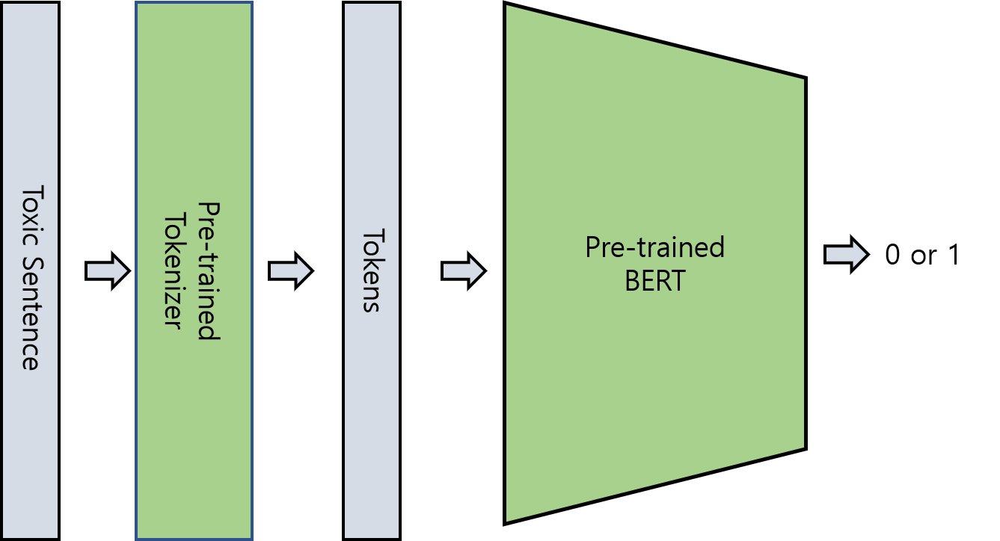

# Toxic_Sentence

#### This is a simple BERT Solution for Kaggle [Jigsaw Toxic Sentence Classification](https://www.kaggle.com/c/jigsaw-unintended-bias-in-toxicity-classification/overview)

<p align="center"> </p>

Install Packages
------------
```
pip install pytorch-pretrained-bert==0.6.1 tqdm numpy
```
Dataset
--------
To download dataset you should login to Kaggle and register for the competition   
[Toxic Sentence Classification Dataset](https://www.kaggle.com/c/jigsaw-unintended-bias-in-toxicity-classification/data)

Train
------
[BERT_main.py](https://github.com/SangKyuu/Toxic_Sentence/blob/master/BERT_main.py)
to train on Toxic Sentence dataset


Test
-------
[BERT_predict.py](https://github.com/SangKyuu/Toxic_Sentence/blob/master/BERT_predict.py)
to test and make submission file for competition


